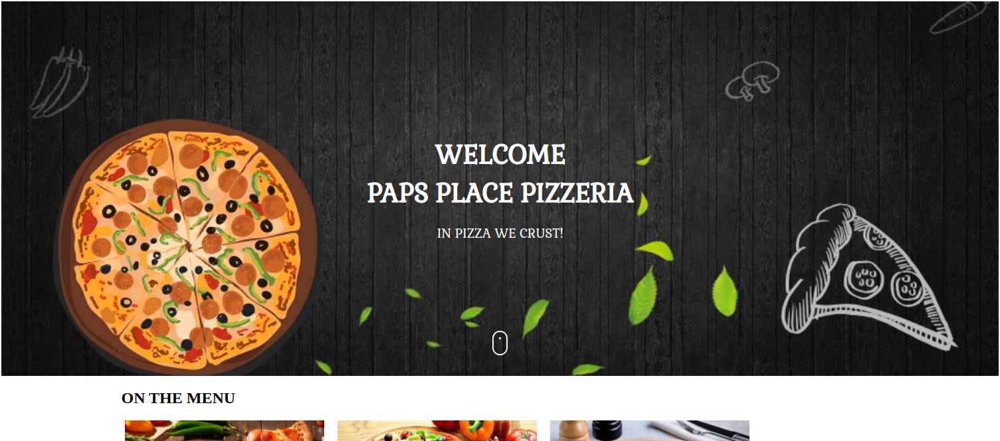

# {PAPS PLACE PIZZERIA}
#### {This is Paps Place Pizzeria}, {1500hrs, 18th March 2022}
#### By **{Linetlucy Genchabe}**
## Description
This is an application that enables quick and convenient pizza orders from paps place pizzeria.
You can view the types of pizza available, pick toppings,crust and size. The customer can also choose to get the pizza delivered to them by just giving their delivery details.
## UI

## Setup/Installation Requirements
* Open Terminal 

* git clone https://github.com/linetlucy-genchabe/paps-place-pizzeria.git

* cd paps-place-pizzeria

* code . or atom . 

## Known Bugs
There are no known bugs as of now.
## Technologies Used
* JAVA SCRIPT
* HTML
* CSS
* BOOTSTRAP
## Support and contact details
if you have any questions contact me via email: linetlucy21@gmail.com
### License
* MIT license
Copyright (c) {2022} **{linetlucy's PAPS PLACE PIZZERIA}**
  